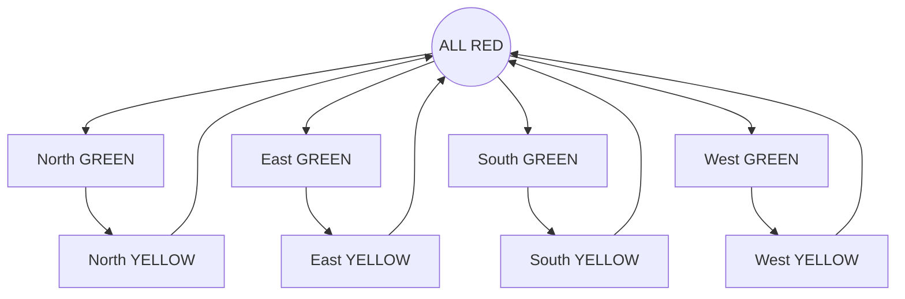

# 🚦 4-Way Traffic Light Controller (Verilog FSM)


## 📖 Short Description

A synthesizable **4-way traffic light controller** implemented using a **Finite State Machine (FSM)** in Verilog. The design features a single shared timer, explicit phase rotation, and strictly defined **GREEN–YELLOW–RED** timing. It has been verified using waveform-based simulation on EDA Playground.

---

## 📋 Project Overview

This project models a standard road intersection (North, East, South, West). The controller guarantees:

* **Safety:** Only one direction is GREEN at any time.
* **Warning:** A YELLOW transition occurs before every RED.
* **Buffer:** A short ALL-RED safety interval exists between direction changes.
* **Fairness:** Cyclic servicing of all four directions (Round Robin).

The design is **fully synthesizable**, parameterised for timing, and focuses on clean digital design methodology.

---

## 🎯 Design Objectives

* **FSM Methodology:** Model real-world control logic using explicit state encoding.
* **Synchronous Design:** Implement time-based transitions using counters (no `initial` delays or non-synthesizable waits).
* **Safety Critical:** Ensure no overlapping GREEN signals.
* **Modularity:** Keep the design readable, extensible, and interview-ready.
* **Simulation Flexibility:** Support both "Realistic" and "Fast" simulation modes via parameters.

---

## ⚙️ FSM State Definition

The FSM uses **explicitly encoded states** to improve debugging clarity and waveform analysis.

| State Code | Description | Active Lights |
| :--- | :--- | :--- |
| **s0** | **ALL RED** | All directions RED |
| **s1** | **North GREEN** | North traffic flows |
| **s2** | **North YELLOW** | North warning |
| **s3** | **East GREEN** | East traffic flows |
| **s4** | **East YELLOW** | East warning |
| **s5** | **South GREEN** | South traffic flows |
| **s6** | **South YELLOW** | South warning |
| **s7** | **West GREEN** | West traffic flows |
| **s8** | **West YELLOW** | West warning |

### Operation Sequence

The controller follows a fixed cyclic sequence to ensure deterministic behavior and no starvation.


## ⏱️ **Timing Strategy**
All timing is derived from the system clock. No real-time delays are used.
**Parameter**: CLK_FREQ (Clock frequency in Hz)
The timing intervals are calculated as:
* **GREEN**: 3 × CLK_FREQ
* **YELLOW**: 0.5 × CLK_FREQ
* **ALL RED**: 0.5 × CLK_FREQ

**Examples**

|**Mode**|**CLK_FREQ**|**GREEN Duration**|**YELLOW Duration**|
| :--- | :--- | :--- | :--- | 
|Fast Sim|10 Hz|30 cycles|5 cycles|
|Real World|1 MHz|3.0 seconds|0.5 seconds|

## **🏗️ Architecture**
**1. Timer Design**
A single shared counter is used for all FSM states to optimize resource usage.
* The FSM state selects the required duration.
* The counter increments on every clock edge.
* A timer_done signal triggers the state transition.

**2. Phase Rotation Logic**
A dedicated phase register determines which direction gets the next GREEN light. This separates the timing logic from the sequencing logic.

* **0**: North
* **1**: East
* **2**: South
* **3**: West

**3. Output Logic (Moore Machine)**
Outputs depend only on the current state, ensuring stable, glitch-free signals.
```(verilog)
// Signal Encoding
localparam GREEN  = 3'b001;
localparam YELLOW = 3'b010;
localparam RED    = 3'b100;
```

## **✅ Verification**
Verification was performed using Icarus Verilog and analyzed via GTKWave/EPWave.
**Verified Properties:**

* **[x]** No two directions are GREEN simultaneously.
* **[x]** All directions eventually receive service (Fairness).
* **[x]** FSM never enters a deadlock.
* **[x]** System resets cleanly to ALL RED.

## **🛠️ Tools Used**
* **Language**: Verilog HDL
* **Simulator**: Icarus Verilog (EDA Playground)
* **Waveform Viewer**: EPWave / GTKWave

## **🚀 Future Extensions**
* **🚶** Pedestrian Crossing: Add interrupt-based walk signals.
* **🚑** Emergency Override: Priority logic for emergency vehicles.
* **🤖** Adaptive Timing: Traffic-density based timing adjustments.
* **⚠️** Formal Verification: Adding assertions (SVA) for safety constraints.


